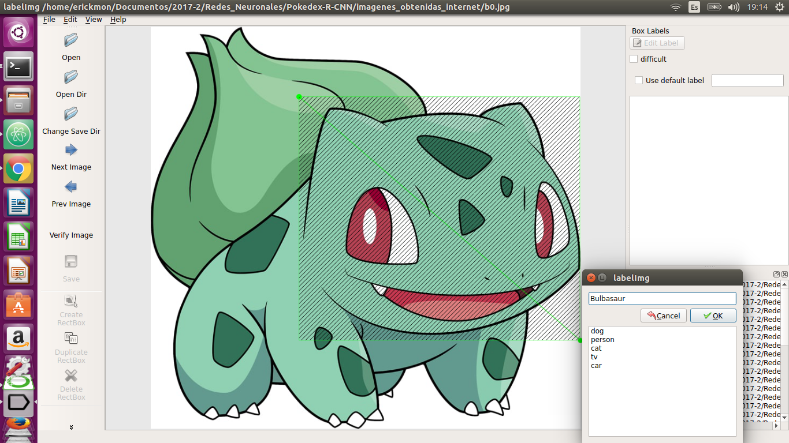
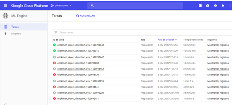

# Introducción 
Para poder usar tu propio conjunto de datos en el API de Object Deteccion de Tensorflow necesitamos
archivos los archivos de prueba y entrenamiento en formato **TFRecord**

## Mapas de Etiqueta (Label Maps)
Cada imagen debe tener asociada a ella un label map para que funcione el entrenamiento.
Este label map define es el vinculo entre la imagen y la clase a la que pertenece.
es un **item** con los atributos **id** y **name** cabe mencionar que siempre comienza desde el id 1. 

Los mapas de etiquetas de muestra se pueden encontrar en el proyecto de [tensorflow/models](https://github.com/tensorflow/models) 
en la carpeta: **[object_detection / data](https://github.com/tensorflow/models/tree/master/research/object_detection/data).**

## Requisitos
Para cada imagen debes tener lo siguiente:
1. Un conjunto de imagenes en formato .jpg o .png con un cuadro donde indique a la clase a la que pertenece y un nombre
2. Tener una carpeta de imagens con las de entrenamiento y las de prueba (train y train)
3. Instalar Label Img para crear nuestros cuadros delimitadores.
4. Generar el .xml para cada imagen.
5. Generar un archivo .csv
6. Generar el .record para realizar el entrenamiento
7. Define tus clases en un archivo .pbtxt

## Imagenes
En mi caso tengo una carpeta llamada object_detection en la cual tengo la carpeta llamada images la cual
contiene 2 carpetas donde tengo las imagenes de entrenamiento (train) y de prueba (test).
Tambien haré la detección para 4 tipos de pokemones: *"Bulbasaur","Pikachu","Charmander" y "Squirtle"*.
Y tendre al rededor de 50 imagenes de cada pokemon para entrenamiento y 15 para prueba.

## Generar el archivo .xml
Para poder generar el archivo .xml el cual es el que contendra la informacion de la imagen y el
rectangulo donde detectara a nuestro objeto (pokemon).
Hay muchas formas para poder generar los rectangulos en mi caso usare la herramienta label img,
la cual la puedemos conseguir [aquí](https://github.com/tzutalin/labelImg).
Si tu conoces otra forma utilizala.

Sigue las instrucciones descritas en ese github para instalarla.
Una vez instalada abriremos nuestras imagenes bajadas de internet y empezaremos a crear los
rectangulos.
Para abrir la aplicacion usamos el comando:
```lang-none
#Debemos estar en la caprpeta labelImg
python labelImg.py
```


Algo asi debería de aparecer:


Una vez guardada la imagen nos generara un archivo .xml esto hay que hacerlo para todas las 
imagenes de los pokemones ya sean de entrenamiento o de prueba.

## Convertiendolo a .csv
Necesitamos convertilo a este formato para asi despues poderlo convertir a .record que es el que usa
Tensorflow para el entrenamiento. 
Para poderlo generar necesitamo el archivo **"xml_to_csv.py"** que se encuentra dentro de la carpeta object-detection.
Para poder utilizarlo hacemos el comando: 
```lang-none
python xml_to_csv.py
```
Una vez echo esto nos debe tirar un mensaje de que la conversion salio bien y habernos generado 2 archivos:
train.csv y test.csv.

## Convertiendolo a .record
Esta es la parte mas importante y es la que se requiere para el entrenamiento
```lang-none
#para el de entrenamiento
python generate_tfrecord.py --csv_input=data/train_labels.csv  --output_path=data/train.record

#para el de prueba
python generate_tfrecord.py --csv_input=data/test_labels.csv  --output_path=data/test.record
```
## Creando nuestras clases
Crea un documento con la extencion .pbtxt en el se incluiran nuestras clases y los nombres
en mi caso lo llame pokemones.pbtxt y metí mis 4 clases de pokemones.

## Tips
Asegurate de tener tus imagenes en formato .jpg, ademas de que todas las imagenes coincidan con su .xml 
y una mas muy importante que todas las imagenes se puedan visualizar ya que si no puden generar errores a la
hora del entrenamiento como estos:


## Siguiente paso
Una vez hecho esto ya tienes listo tu propio data set lo que ahora tienes que hacer es subirlo a Google Cloud para
entrenarlo y generar tu modelo [crear tu modelo](https://github.com/ErickLF/Pokedex-R-CNN/blob/master/crear_modelo_clasificador_pokemones.md)