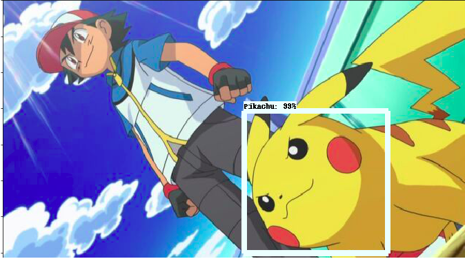
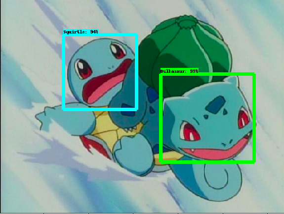
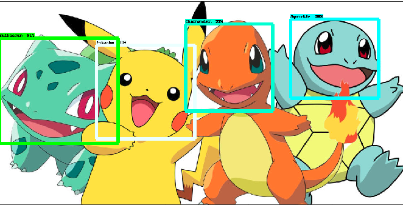

# Pokedex 
Proyecto para la materia de **Redes Neuronales**

Este un problema de deteccion de objetos en nuestro caso **Pokemones** donde identificaremos
que tipo de pokemon es el que esta en una imagen dada y para ello utilizaremos algunas herramientas
como el **API de Deteccion de Objetos de Tensorflow** y un poco de **Google Cloud**.

Ademas tomaremos como base un proyecto de github el cual lo puedes conseguir [aqui]((https://github.com/tensorflow/models))

Así que deberas descargarlo para hacer tus propias pruebas en tu computadora e ir a la par con este proyecto
ya que daremos las bases para que tu sigas los pasos y puedas hacer tu propio pokedex.

## Objetivos

De una imagen cualquiera ya sea indvidual, es decir donde aparzca un solo pokemon o una imagen grupal donde 
aparzcan varios poder identificar los pokemones que aparecen en dicha imagen.

## Red Neuronal Convolucional Regional (R-CNN)

## Recomendacion

Este proyecto en principio se puede desarrollar en cualquier sistema operativo ya sea *Windows,Os o Linux* por
experiencia propia te recomiendo que uses **Linux** y si no lo tienes te recomiendo que lo instales ya sea aciendo una
particion en tu sistema operativo si es Windows. Ya que es mas fácil de instalar y ejectuar todos los 
comandos necesarios presentados en esta página y por lo general para estos tipos de proyctos.

## Resultados

Estos resultados fueron obtenidos al final del entrenamiento:

Un solo pokemon

Dos pokemones juntos

4 pokemones

