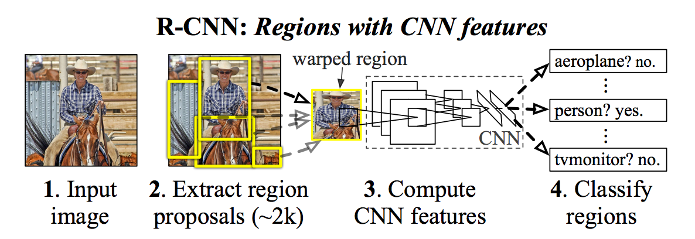

# Pokedex 
Este proyecto surge para la materia de **Redes Neuronales** en la Universidad de Sonora.

El cual es un problema de detección de objetosel cual se puede aplicar a cualquier cosa (persona,animal) y
en nuestro caso en particular seran **Pokemones** donde identificaremos en una imagen de la caricatura
el nombre del pokemon y para ello utilizaremos algunas herramientas
comolo son: 
1. **API de Deteccion de Objetos de Tensorflow**
2. **Google Cloud** para el entrenamiento.

Tomando como referencia el proyecto de github el cual lo puedes conseguir [aqui](https://github.com/tensorflow/models)
es muy importante, así que deberas descargarlo o clonarlo para tenerlo a la mano ya que es complementario a este
proyecto ya que se requiere para el funcionamiento de este.

Una vez descargado podras probar este proyecto e inclusive te dejamos los pasos para que realices cualquier
otro proyecto que desees incusive para que agregues mas pokemones a tu identificador.

## Objetivos

El objetivo principal, ya mencionado previamente es: *De una imagen cualquiera ya sea indvidual, 
es decir donde aparzca un solo pokemon o una imagen grupal donde 
aparzcan varios poder identificar los pokemones que aparecen en dicha imagen en mi caso solo identificare a 4
pokemones los cuales son: **"Pikachu, Bulbasaur, Charmander y Squirtle"** *.

## ¿Cómo funciona? 
Funciona con una *Red Neuronal Convolucional basada en Region (R-CNN)*, pero entonces que es una R-CNN.

Combina elementos de las tareas de de detección de objetos utilizando visión por computadora clásica, 
donde el objetivo es clasificar objetos individuales y localizar cada uno usando un cuadro delimitador, 
y segmentación semántica, donde el objetivo es clasificar cada píxel en conjunto fijo de categorías 
sin diferenciar instancias de objeto.
Sin embargo, mostramos que un sistema sorprendentemente simple, flexible y rápido puede superar los 
resultados de segmentación de instancias anteriores.

El enfoque basado en la región CNN (R-CNN) para la detección de objeto de cuadro delimitador es 
atender a un número manejable de regiones de objeto candidatos y evaluar redes convolucionales 
independientemente en cada región de interes (RoI).

R-CNN se amplió para permitir la asistencia a RoI en mapas de características usando RoIPool, 
lo que permite una velocidad más rápida y una mayor precisión.A esta ampliacion
se le conoce como Faster R-CNN  es flexible y robusto para muchas mejoras de seguimiento, 
y es el marco líder actual en varios puntos de referencia.

Para mañor informacion puedes consultar este [artículo](https://arxiv.org/pdf/1703.06870.pdf) muy bien explicado.

Además para acelerar nuestro aprendizaje utilizamos *Objetos Comunes en Contexto* mas comunmente conocido como COCO
para poder transferir el aprendizaje de un modelo ya definido a nuestro propio modelo, este modelo puede
ser ya sea personas, animales, objetos, etc. 
Tienen un amplio dataset ya definido.

## Recomendacion

Este proyecto en principio se puede desarrollar en cualquier sistema operativo ya sea *Windows,Os o Linux* por
experiencia propia te recomiendo que uses **Linux** y si no lo tienes te recomiendo que lo instales ya sea aciendo una
particion en tu sistema operativo si es Windows. Ya que es mas fácil de instalar y ejectuar todos los 
comandos necesarios presentados en esta página y por lo general para estos tipos de proyctos.

## Resultados

Estos resultados fueron obtenidos al final del entrenamiento:

Un solo pokemon

Dos pokemones juntos

4 pokemones

