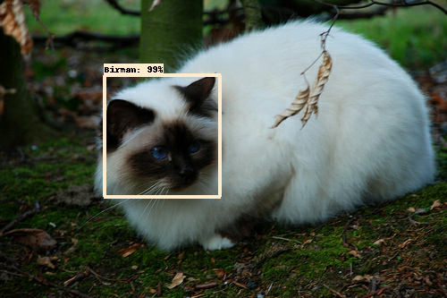
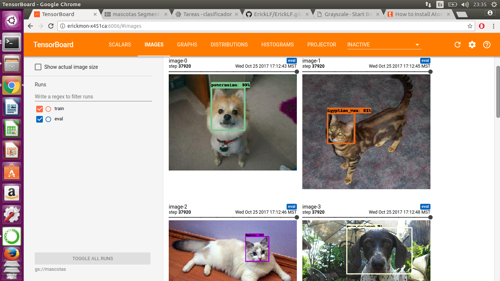

# Entrenamiento distribuido en con el conjunto de datos "Oxford-IIIT Pets" en Google Cloud

Aquí veremos como entrenar un detector de objetos usando claro **Tensorflow
Object Detection API**.En este tutorial veremos como entrenar los datos de Oxford-IIIT Pets
para contruir un sistema que distinga entre varias razas de gatos y perros.
La salida sera algo así como la siguiente:




## Configuración de un proyecto en Google Cloud

Para aceler el proceso de entrenamiento y evaluacion correremos nuestros archivos en 
[Google Cloud ML Engine](https://cloud.google.com/ml-engine/) para usar multiples GPUs.Para
comenzar a usar Google Cloud seguiremos los siguientes pasos (si ya tienes tu proyecto has caso
omiso)

1. [Crea un proyecto GCP](https://cloud.google.com/resource-manager/docs/creating-managing-projects).

2. [Instala el SDK de Google Cloud SDK](https://cloud.google.com/sdk/downloads) en donde
vayas a trabajar ya sea laptop o computadora de escritorio.
Esto proporciona las herramientas necesarias para subir archivos a Google Cloud Storage y
comenzar con el entrenamiento de ML.

3. [Habilita ML Engine APIs](https://console.cloud.google.com/flows/enableapi?apiid=ml.googleapis.com,compute_component&_ga=1.73374291.1570145678.1496689256).
Por default, un nuevo proyecto GCP no las tiene habilitadas entra al siguiente link para
habilitarlas.

4. [configurar un segmento de Google Cloud Storage (GCS)](https://cloud.google.com/storage/docs/creating-buckets)
.Aquí subiremos nuestro conjunto de datos para el entrenamiento.

Recuerda tu nombre que le has puesto a tu segmento ya que se usara mucho
a continuación.

Para tu conveniencia define una variable con el nombre de tu segmento así:

``` 
export YOUR_GCS_BUCKET=${entrenador_mascotas}

```

## Instalar Tensorflow y Tensorflow Object Detection API

Por favor vea como se instala en el archivo [instalacion](instalacion.md)
para instalar Tensorflow y todas sus dependencias. Asegurate de tener 
funcionando protobuf y `PYTHONPATH`.

## Obteniendo el conjunto de datos Oxford-IIIT Pets y subirlo a Google Cloud Storage

Para entrenar al detector necesitamos un conjunto de imagenes, cudros delimitadores y
las clasificaciones. Para esta prueba vamos a usar Oxford-IIIT Pets dataset. Podemos encontrarlo
[aqí](http://www.robots.ox.ac.uk/~vgg/data/pets/). Necesitamos descargar estos archivos [`images.tar.gz`](http://www.robots.ox.ac.uk/~vgg/data/pets/data/images.tar.gz)
y [`annotations.tar.gz`](http://www.robots.ox.ac.uk/~vgg/data/pets/data/annotations.tar.gz)
En el directorio principal y descomprimirlos (esto puede tardar algo).

``` bash
# From tensorflow/models/research/
wget http://www.robots.ox.ac.uk/~vgg/data/pets/data/images.tar.gz
wget http://www.robots.ox.ac.uk/~vgg/data/pets/data/annotations.tar.gz
tar -xvf images.tar.gz
tar -xvf annotations.tar.gz
```

Despues de descargar tendras tus archivos ahi:

```lang-none
- images.tar.gz
- annotations.tar.gz
+ images/
+ annotations/
+ object_detection/
... other files and directories
```

Tensorflow Object Detection API espera datos en el formato **TFRecord**,
para ello correremos el archivo `create_pet_tf_record` para convertir los datos
de Oxford-IIIT Pet en TFRecords. Corre el siguiente comando:

``` bash
# From tensorflow/models/research/
python object_detection/create_pet_tf_record.py \
    --label_map_path=object_detection/data/pet_label_map.pbtxt \
    --data_dir=`pwd` \
    --output_dir=`pwd`
```

Nota: Es normal ver varios mensajes de advertencia solo ignoralos

Se deben generar dos archivos nombrados `pet_train.record` y `pet_val.record` en el
directorio.

Ahora los datos han sido generados, vamos a necesitar subirlos a Google Cloud
Storage para que sea accedido por ML Engine. copia el siguiente comando
para subirlos (sustituyendo `${YOUR_GCS_BUCKET}`):

Deberas de haber iniciado sesion antes en Google Cloud para poder ejecutar 
los siguientes comandos

```
#Se inicia sesion
gcloud auth login
``` 


``` bash
# Desde tu directorio principal
gsutil cp pet_train.record gs://${YOUR_GCS_BUCKET}/data/pet_train.record
#En mi caso fue:
gsutil cp pet_train.record gs://entrenador_mascotas/data/pet_train.record
gsutil cp pet_val.record gs://entrenador_mascotas/data/pet_val.record
gsutil cp object_detection/data/pet_label_map.pbtxt gs://entrenador_mascotas/data/pet_label_map.pbtxt
```

Por favor, recuerda la ruta en la que cargas los datos, ya que necesitaremos esta
información al configurar el pipeline en un siguiente paso


## Descargando COCO-pretrained Model para el aprendizaje de transferencia

Capacitar a un detector de objetos de última generación desde cero puede llevar días, 
incluso cuando se utilizan múltiples GPU! Para acelerar el entrenamiento, tomaremos un 
detector de objetos entrenado en un conjunto de datos diferente (COCO) y reutilizaremos parte de su
parámetros para inicializar nuestro nuevo modelo.

Descargar [COCO-pretrained Faster R-CNN with Resnet-101 model](http://storage.googleapis.com/download.tensorflow.org/models/object_detection/faster_rcnn_resnet101_coco_11_06_2017.tar.gz).
Descomprime el contenido  `model.ckpt*` y agregalos en tu segmento GCS .

``` bash
wget http://storage.googleapis.com/download.tensorflow.org/models/object_detection/faster_rcnn_resnet101_coco_11_06_2017.tar.gz
tar -xvf faster_rcnn_resnet101_coco_11_06_2017.tar.gz
gsutil cp faster_rcnn_resnet101_coco_11_06_2017/model.ckpt.* gs://${YOUR_GCS_BUCKET}/data/
#En mi caso
gsutil cp faster_rcnn_resnet101_coco_11_06_2017/model.ckpt.* gs://entrenador_mascotas/data/
```

Recuerde la ruta a la que cargó el punto de control del modelo, ya que lo necesitaremos en el siguiente paso

## Configurando Object Detection Pipeline

En Tensorflow Object Detection API, los parámetros del modelo, 
los parámetros de entrenamiento y los parámetros de evaluación están definidos 
por un archivo de configuración. Más detalles se pueden encontrar [aquí](configuring_jobs.md). 
Para este tutorial, utilizaremos algunas plantillas predefinidas proporcionadas 
con el código fuente. En la carpeta`object_detection/samples/configs` , Esta es la configuracion de
los object_detections. Usaremos `faster_rcnn_resnet101_pets.config` como
punto de partida para configurar el pipeline. Abra el archivo con sueditor de texto.

Tendremos que configurar algunas rutas para que la plantilla funcione. 
Busque en el archivo las instancias de `PATH_TO_BE_CONFIGURED` y remplazala
con el valor apropiado (`gs://${YOUR_GCS_BUCKET}/data/`) 

Luego cargue su archivo editado en GCS, tomando nota de la ruta en la que se cargó 
(lo necesitaremos cuando inicie los trabajos de entrenamiento / evaluación).

``` bash
#From tensorflow/models/research/

#Edit the faster_rcnn_resnet101_pets.config template. Please note that there
#are multiple places where PATH_TO_BE_CONFIGURED needs to be set.

sed -i "s|PATH_TO_BE_CONFIGURED|"gs://entrenador_mascotas"/data|g" \
    object_detection/samples/configs/faster_rcnn_resnet101_pets.config

#Copy edited template to cloud.
gsutil cp object_detection/samples/configs/faster_rcnn_resnet101_pets.config \
    gs://entrenador_mascotas/data/faster_rcnn_resnet101_pets.config
```

## Checando tu segmento Google Cloud Storage

En este punto tu deberias tener los siguientes archivos en tu segmento de 
Google Cloud:

```lang-none
+ ${YOUR_GCS_BUCKET}/
  + data/
    - faster_rcnn_resnet101_pets.config
    - model.ckpt.index
    - model.ckpt.meta
    - model.ckpt.data-00000-of-00001
    - pet_label_map.pbtxt
    - pet_train.record
    - pet_val.record
```

Puedes ver tu segmento aquí [Google Cloud Storage browser](https://console.cloud.google.com/storage/browser).

## Empezando el entrenamiento y la evaluacion en Google Cloud ML Engine

Antes de emezar debemos tener lo siguiente:

1. Paquetes de Tensorflow Object Detection.
2. Hacer la configuracion de clusters en Google Cloud ML.

El paquete de Tensorflow Object Detectio, es generado con el siguiente comando en 
`tensorflow/models/research/`:

``` bash
#From tensorflow/models/research/
python setup.py sdist
(cd slim && python setup.py sdist)
```

Debes ver dos archivos tar.gz files created en `dist/object_detection-0.1.tar.gz`
y `slim/dist/slim-0.1.tar.gz`.

Para correr el entrenamiento en Cloud ML, configuraremos el cluster para usar 10
training jobs (1 master + 9 workers).El archivo de configuracion en `object_detection/samples/cloud/cloud.yml`.

Para empezar a entrenar sigue el siguiente comndo en el directorio:
`tensorflow/models/research/`

``` bash
#From tensorflow/models/research/
gcloud ml-engine jobs submit training `whoami`_object_detection_`date +%s` \
    --job-dir=gs://entrenador_mascotas/train \
    --packages dist/object_detection-0.1.tar.gz,slim/dist/slim-0.1.tar.gz \
    --module-name object_detection.train \
    --region us-central1 \
    --config object_detection/samples/cloud/cloud.yml \
    -- \
    --train_dir=gs://entrenador_mascotas/train \
    --pipeline_config_path=gs://entrenador_mascotas/data/faster_rcnn_resnet101_pets.config
```

Una vez que el entrenamiento comience usaremos este comando ahora:

``` bash
#From tensorflow/models/research/
gcloud ml-engine jobs submit training `whoami`_object_detection_eval_`date +%s` \
    --job-dir=gs://entrenador_mascotas/train \
    --packages dist/object_detection-0.1.tar.gz,slim/dist/slim-0.1.tar.gz \
    --module-name object_detection.eval \
    --region us-central1 \
    --scale-tier BASIC_GPU \
    -- \
    --checkpoint_dir=gs://entrenador_mascotas/train \
    --eval_dir=gs://entrenador_mascotas/eval \
    --pipeline_config_path=gs://entrenador_mascotas/data/faster_rcnn_resnet101_pets.config
```

Puedes detener el proceso en: [ML Engine Dashboard](https://console.cloud.google.com/mlengine/jobs).

## Monitoriando el aprendizaje con TensorBoard

Tu puedes ver como va avanzado tu entrenamiento de manera local al acceder estos
comandos:
``` bash
# This command needs to be run once to allow your local machine to access your
# GCS bucket.
gcloud auth application-default login

tensorboard --logdir=gs://entrenador_mascotas
```
Una vez que corres este comando al irte a `localhost:6006` en tu navegador,
en mi caso me teenia que ir a otra direccion pero no te preocupes
ahi te dice a que direccion irte, podras ver en **SCALARES** algo así:


Tienes que irte a la pestaña de imagenes para ver algo así:



Nota: Esto puede tardar mucho tiempo para empezar a ver resultados en tu Tensorboard
por lo general es a partir de las dos horas cuando empiezas a ver las imagenes y las
graficas, a demas puedes ver como van tus procesos de CPU en esta pagina:
[ML Engine Dashboard](https://console.cloud.google.com/mlengine/jobs). 
Puedes parar el entrenamiento en el momento que tu quieras por lo general cuando 
veas que ya ha empezado a claseificar muy bien, ya sea viendo la funcion de perdida
o la clasificacion de las muestras.

## Exportando la grafica de Tensorflow

Despues de que tu modelo ha sido entrenado deberas de ver cual checkpoint
es el que vas a seleccionar, para ello puedes ver en las imagenes cual punto fue 
el que las clasifico mejor.Los encontraras aquí [Google Cloud Storage Browser](https://console.cloud.google.com/storage/browser). 
Debajo de  `${YOUR_GCS_BUCKET}/train`. 
Los checkpoints por lo general contienen los siguientes 3 archivos:
* `model.ckpt-${CHECKPOINT_NUMBER}.data-00000-of-00001`
* `model.ckpt-${CHECKPOINT_NUMBER}.index`
* `model.ckpt-${CHECKPOINT_NUMBER}.meta`

Despues de haberlos identificado, vete a `tensorflow/models/research/` y ejecuta los siguientes comandos:
``` bash
# From tensorflow/models/research/
gsutil cp gs://mascotas/train/model.ckpt-60391.* .
python object_detection/export_inference_graph.py \
    --input_type image_tensor \
    --pipeline_config_path object_detection/samples/configs/faster_rcnn_resnet101_pets.config \
    --trained_checkpoint_prefix model.ckpt-60391 \
    --output_directory output_inference_graph.pb
```

Despues de eso veras un archivo así: `output_inference_graph.pb`.

## Que sigue?
Felicidade has entrenado un clasificador de mascotas, ahora solo falta probarlo y una
vez que funcione haremos nuestro propio dataset de pokemones.
