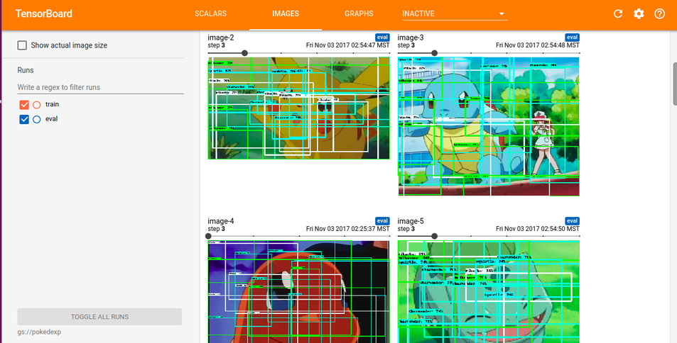
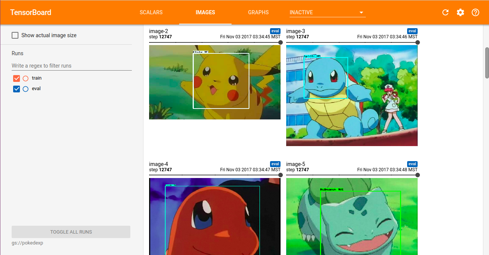

# Modelo de Pokemones 

Estamos cada vez mas cerca de tener nuestro propio identificador de pokemones.
Para ello primero debemos de tener un dataset, en caso de querer utilizar tu propio dataset,
te recomiendo que cheques la parte de [como hacer tu dataset](https://github.com/ErickLF/Pokedex-R-CNN/blob/master/Crea_tu_propio_DataSet.md).

Bien una vez hecho tu dataset vamos a necesitar:

1. Crear un nuevo segmento de datos en Google Cloud
2. Subir los archivos
3. Configurar el pipeline
4. Descargar el modelo

## Segmento de datos
Para crearlo te recomiendo ver este ejemplo de [como usar Google Cloud](clasificador_de_mascotas_en_Google_Cloud.md)

## Subir archivos
Necesitamos subir los archivos:
1. train.record ```gsutil cp data/train.record gs://pokedexp/data/train.record```
2. test.record ```gsutil cp data/test.record gs://pokedexp/data/test.record```
3. checkpoints de un modelo ya pre-entrenado 
```gsutil cp ssd_mobilenet_v1_coco_11_06_2017/model.ckpt.* gs://pokedexp/data/```
4. El archivo .pbtxt con las clases
```gsutil cp pokemones.pbtxt gs://pokedexp/data/pokemones.pbtxt```
5. Configurar el archivo ssd_mobilenet_v1_coco_11_06_2017.config para tu segmento
* ponemos el numero de clases y configuramos los PATHS poniendo nuestro segmento
6. Subirlo ```gsutil cp ssd_mobilenet_v1_pets.config \
    gs://pokedexp/data/ssd_mobilenet_v1_pets.config```
7. Configurar el pipeline para eso debemos de irnos a el proyecto principal de models y correr
    el siguiente comando:
    ```
    gcloud ml-engine jobs submit training `whoami`_object_detection_`date +%s` \
    --job-dir=gs://pokedexp/train \
    --packages dist/object_detection-0.1.tar.gz,slim/dist/slim-0.1.tar.gz \
    --module-name object_detection.train \
    --region us-central1 \
    --config object_detection/samples/cloud/cloud.yml \
    -- \
    --train_dir=gs://pokedexp/train \
    --pipeline_config_path=gs://pokedexp/data/ssd_mobilenet_v1_pets.config
    ```
8. Configuracion de los CPUS y comenzar el entrenamiento:
    ```
    gcloud ml-engine jobs submit training `whoami`_object_detection_eval_`date +%s` \
    --job-dir=gs://pokedexp/train \
    --packages dist/object_detection-0.1.tar.gz,slim/dist/slim-0.1.tar.gz \
    --module-name object_detection.eval \
    --region us-central1 \
    --scale-tier BASIC_GPU \
    -- \
    --checkpoint_dir=gs://pokedexp/train \
    --eval_dir=gs://pokedexp/eval \
    --pipeline_config_path=gs://pokedexp/data/ssd_mobilenet_v1_pets.config
    ```
9. Ver el avance de tu entrenamiento
    ```tensorboard --logdir=gs://pokedexp```
    Al inicio:
    
    
10. Experotar tu modelo para ello deberas seleccionar el checkpoint que mas te convenga en mi caso es ```182989```
    ```
    gsutil cp gs://pokedexp/train/model.ckpt-182989.* .
    python object_detection/export_inference_graph.py \
    --input_type image_tensor \
    --pipeline_config_path object_detection/samples/configs/ssd_mobilenet_v1_pets.config \
    --trained_checkpoint_prefix model.ckpt-182989 \
    --output_directory Modelo_pokemon.pb
    ```
Listo ahora solo tienes que ir a la [libreta de pokemones](https://github.com/ErickLF/Pokedex-R-CNN/blob/master/prueba_pokedex.ipynb) para probarlo 